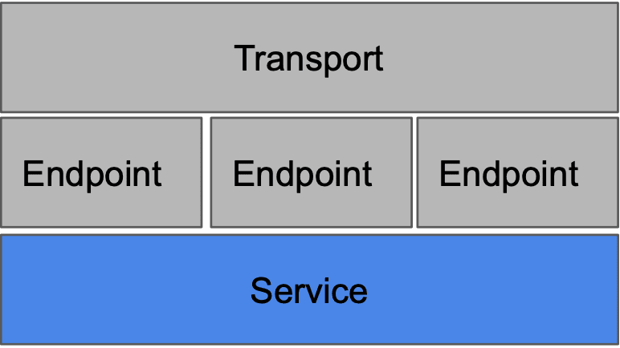
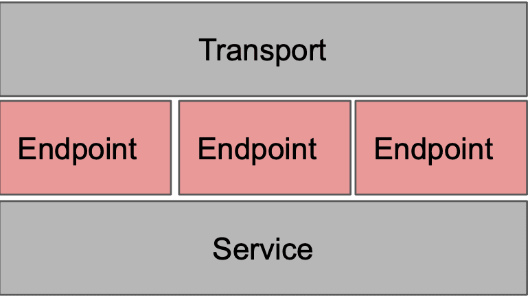
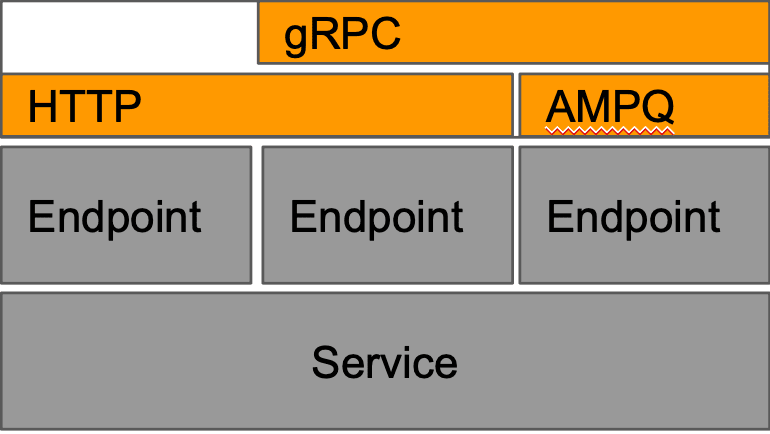

# About The Project
Example golang using GO-KIT framework everything you need :)

## Installation(manually):

   #### run server

    go run cmd/main.go

   #### run client

    go run clients/main.go
    
   #### Swagger API

http://localhost:8081/swagger/index.html/ [link](http://localhost:8081/swagger/index.html)

## Installation(docker):
   #### Prerequisites
   - docker
      for download docker in [link](https://docs.docker.com/engine/install/)

   - docker-compose
      for download docker in [link](https://docs.docker.com/compose/install/)
  
   #### create volume

    docker volume create postgres_data
   
   #######create network
   
    docker network create main
   
   #### run service 
 
    docker-compose up -d --build

   #### Swagger API

http://localhost:8081/swagger/index.html/ [link](http://localhost:8081/swagger/index.html/)

## Architecture:

### Service

Services are where all of the business logic is implemented. In Go kit, services are typically modeled as interfaces, and implementations of those interfaces contain the business logic. Go kit services should strive to abide the Clean Architecture or the Hexagonal Architecture. That is, the business logic should not know of transport-domain concepts: your service shouldn’t know anything about HTTP headers, or gRPC error codes.

### Endpoint

An endpoint is like an action/handler on a controller; it’s where safety and antifragile logic lives. If you implement two transports (HTTP and gRPC), you might have two methods of sending requests to the same endpoint.

### Transport

The transport domain is bound to concrete transports like HTTP or gRPC. In a world where microservices may support one or more transports, this is very powerful; you can support a legacy HTTP API and a newer RPC service, all in a single microservice.
